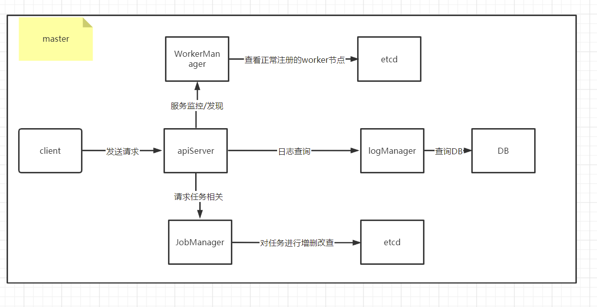
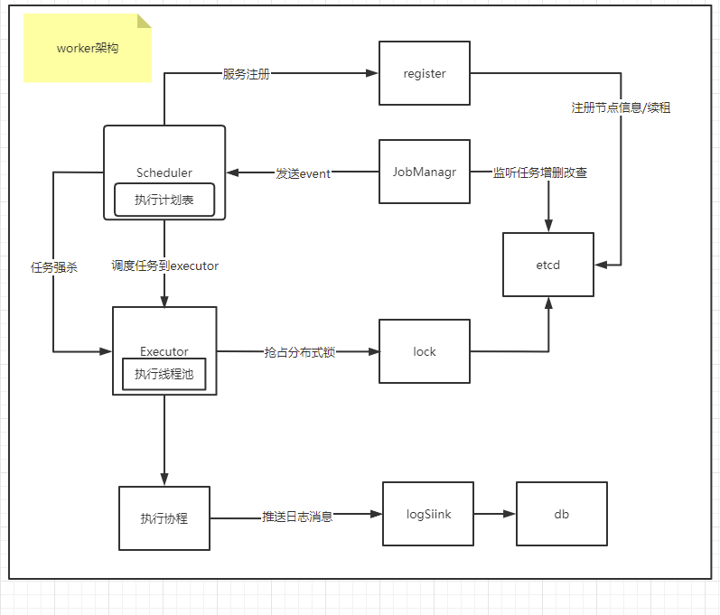

Distributed task scheduling

[refercer](https://github.com/imlgw/scheduler)
## 传统crontab痛点
- 当机器故障时，任务会停止调度，甚至丢失crontab配置
- 任务数量多，单机的硬件资源不够，需要人工迁移到其他机器
- 需要人工去机器上配置cron，任务执行状态不方便查看

## CAP理论（常用于分布式存储）

C：一致性，写入后立即能读取到新值

A：可用性，通常保障最终一致性，因为高可用性必然无法保证一致性

P：分区容错性，必须保证，因为分布式一定需要面对网络分区

## BASE 理论（常用于应用架构）

BA（基本可用）：损失部分可用性，保证整体可用性，例如熔断机制等

S（软状态）：允许状态同步延迟，只要不影响系统即可

E（最终一致性）：经过一段时间后，系统能够达到一致性就好

## Master 架构

## 分布式架构的核心 要素

1. 调度器，**高可用**,由于分布式部署，确保不会由于单点故障停止调度，同时任务数据也是保存在etcd中的，不容易的丢失
2. 执行器，能够具有横向扩展能力,能够提供大量任务的并行处理能力

