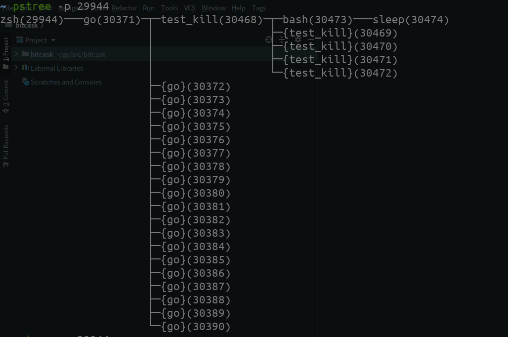
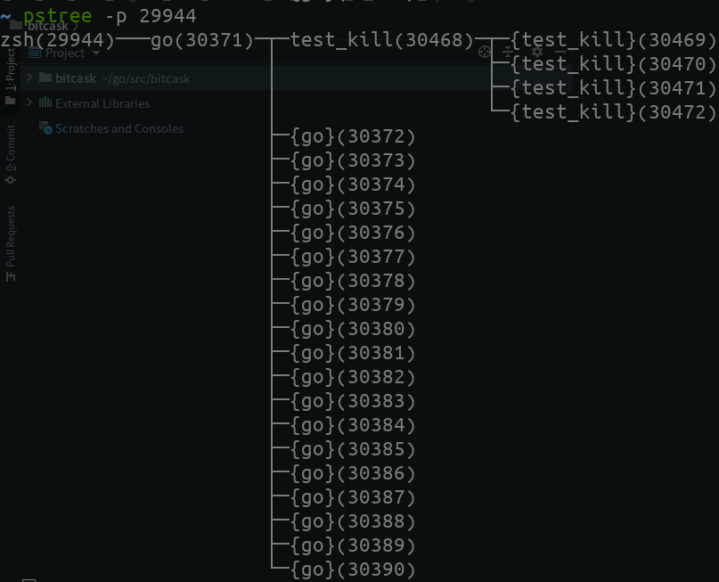

## kill 时产生孤儿进程,导致无法立刻回收协程的问题

### 相关代码
相关测试用例在`tests/test_kill.go`

### 问题描述

当我们使用`go run tests/test_kill.go`运行测试代码,
然后使用`pstree -p` 查看进程树



可以看到 go 进程 `go(30371)─┬─test_kill(30468)─┬─bash(30473)───sleep(30474)`
创建了子进程 `bash(30473)`,该进程又创建了子shell去执行 shell 命令 `sleep(30474)`

>TIPS: subshell
>
>所谓子shell，即从当前shell环境新开一个shell环境，这个新开的shell环境就称为子shell(subshell)，而开启子shell的环境称为该子shell的父shell
>
>何时产生子shell:
>Linux上创建子进程的方式有三种：一种是fork出来的进程，一种是exec出来的进程，一种是clone出来的进程
>
>fork 是复制进程
>
>exec是加载另一个应用程序替换当前运行的进程
>
>为了保证进程安全，若要形成新的且独立的子进程，都会先fork一份当前进程，然后在fork出来的子进程上调用exec来加载新程序替代该子进程。
>
>[reference](https://www.cnblogs.com/f-ck-need-u/p/7446194.html)
>

等待5s后,ctx 理应取消,这时查看进程树



可以看到 子进程`bash(30473)` 被kill了,但是其子shell `sleep(30474)` 没有被回收,而是变成了孤儿进程


同时我们也有几个协程没有结束,查看pprof 堆栈 


```bash
goroutine 1 [syscall]:
syscall.Syscall6(0xf7, 0x1, 0x21b5, 0xc0000b3cd0, 0x1000004, 0x0, 0x0, 0xc000026360, 0x710a60, 0x90bca0)
	/usr/local/go/src/syscall/asm_linux_amd64.s:43 +0x5
os.(*Process).blockUntilWaitable(0xc00001a390, 0x3, 0x3, 0x203000)
	/usr/local/go/src/os/wait_waitid.go:32 +0x9e
os.(*Process).wait(0xc00001a390, 0x6efca0, 0x73b368, 0x73b370)
	/usr/local/go/src/os/exec_unix.go:22 +0x39
os.(*Process).Wait(...)
	/usr/local/go/src/os/exec.go:129
os/exec.(*Cmd).Wait(0xc0000ce6e0, 0x0, 0x0)
	/usr/local/go/src/os/exec/exec.go:507 +0x65
os/exec.(*Cmd).Run(0xc0000ce6e0, 0xc000097290, 0xc0000ce6e0)
	/usr/local/go/src/os/exec/exec.go:341 +0x5f
os/exec.(*Cmd).CombinedOutput(0xc0000ce6e0, 0x9, 0xc0000b3f50, 0x2, 0x2, 0xc0000ce6e0)
	/usr/local/go/src/os/exec/exec.go:567 +0x91
main.main()
	/go/src/scheduler/tests/test_kill.go:23 +0x16c
```

`/go/src/scheduler/tests/test_kill.go:23 ` 这里就是我们调用exec的地方,可以发现,在
```bash
os.(*Process).Wait(...)
	/usr/local/go/src/os/exec.go:129
```
处发生了阻塞

代码如下

```go
// Wait releases any resources associated with the Cmd.
func (c *Cmd) Wait() error {
	if c.Process == nil {
		return errors.New("exec: not started")
	}
	if c.finished {
		return errors.New("exec: Wait was already called")
	}
	c.finished = true

	state, err := c.Process.Wait()
	if c.waitDone != nil {
		close(c.waitDone)
	}
	c.ProcessState = state

	var copyError error
	for range c.goroutine {
		if err := <-c.errch; err != nil && copyError == nil {
			copyError = err
		}
	}

	c.closeDescriptors(c.closeAfterWait)

	if err != nil {
		return err
	} else if !state.Success() {
		return &ExitError{ProcessState: state}
	}

	return copyError
}

```

可以看到一直在等待 `c.errch`

```go
	var copyError error
	for range c.goroutine {
		if err := <-c.errch; err != nil && copyError == nil {
			copyError = err
		}
	}
```

直接看源码,可以发现,在 `func (c *Cmd) Start() error {}` 处有使用该chan

```go
	// Don't allocate the channel unless there are goroutines to fire.
	if len(c.goroutine) > 0 {
		c.errch = make(chan error, len(c.goroutine))
		for _, fn := range c.goroutine {
			go func(fn func() error) {
				c.errch <- fn()
			}(fn)
		}
	}
```

查看源码 可以发现, `c.errch <- fn()`,这个 `fn` 是从 `c.goroutine` 中遍历得到,`	goroutine       []func() error`,
```go
	pr, pw, err := os.Pipe()
	if err != nil {
		return
	}

	c.closeAfterStart = append(c.closeAfterStart, pw)
	c.closeAfterWait = append(c.closeAfterWait, pr)
	c.goroutine = append(c.goroutine, func() error {
		_, err := io.Copy(w, pr)
		pr.Close() // in case io.Copy stopped due to write error
		return err
	})
```
根据以上代码,可以发现主要用于处理输入输出,所以可以确定,我们的golang协程是阻塞在此处,用于接受shell的输入输出,
goroutine 通过 创建的`Pipe管道`,在协程中将pr中的数据拷贝到w中.即通过goroutine 读取子进程的输出

但是由于我们之前说的子shell,他会拷贝当前shell的状态,也就是会把pipe一起进行拷贝,此时,但又由于我们kill没有kill子shell,
导致我们的pipe的写入端被子shell持有,我们的协程会等待pipe关闭后才返回,导致我们程序无法5s后结束的问题

### 问题总结

golang 的　exec 在 使用子进程时会和子进程通过pipe建立连接,通过管道获取子进程的输入输出.在某些情况下,子进程会从当前进程fock出子shell(子子进程),
该子子进程进程会拷贝子进程的pipe,当我们在golang kill 子进程 时,如果没有将 子子进程 一起kill,则会导致pipe 的文件描述符被子子进程持有,而无法关闭.
同时我们的 获取子进程的输入输出 的操作会一致等待 pipe关闭后返回,所以出现 协程无法退出的情况

### 解决办法

golang 中将子进程相关的进程组一起杀死
